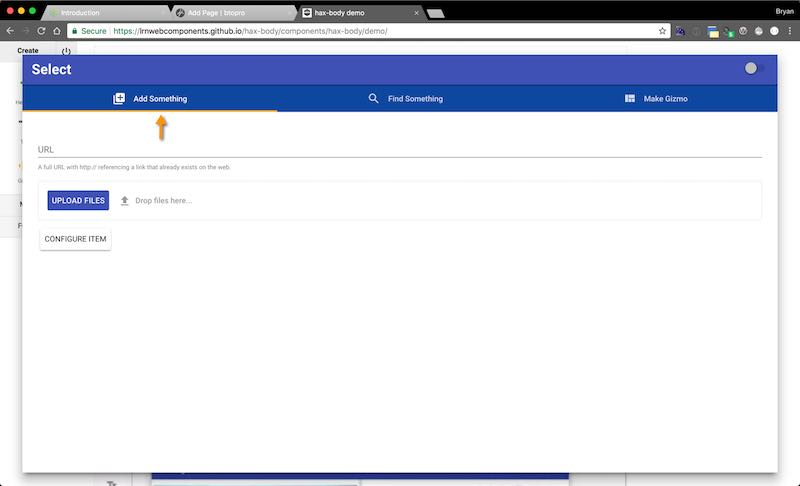
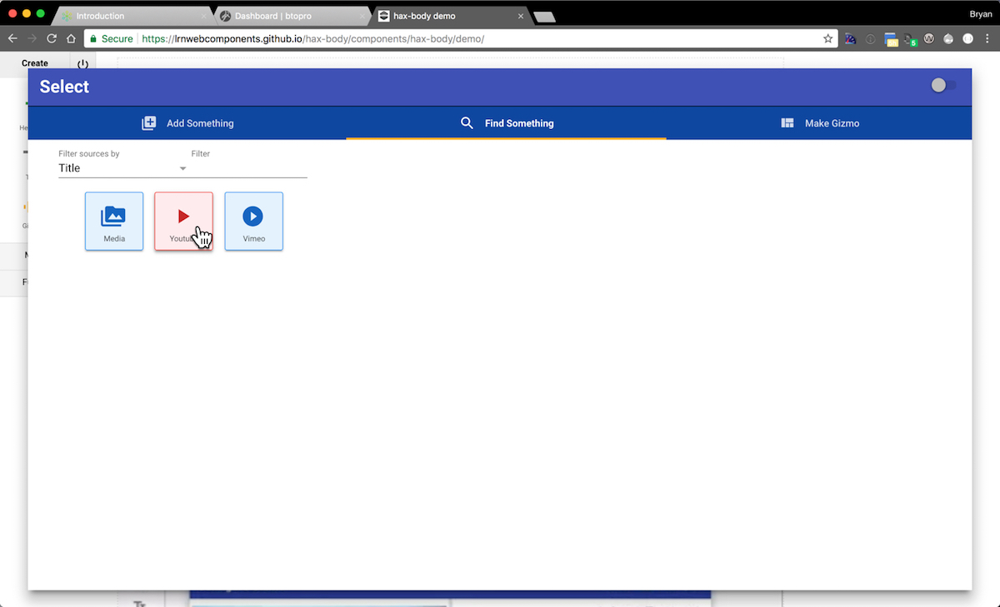

## Cable
In the 40s and 50s, the Cable industry was born. By the mid 60s it had almost a million subscribers. In the 70s and 80s the FCC regulated it heavily because of how much of an influence it had on the American consumer. Cable TV was everywhere by the 90s and currently more then 1/2 of all households have cable based TV. It's a massive industry that's dominated by a handful of players. Those players are the brokers of what is allowed to appear on their listings and as channel options expanded, people increasingly still felt like there's "nothing on". Still, a majority of people still have it because of ease of access (hit the power button on TV and entertainment is there, 0 cognitive load).
Sound familiar? The Cable industry is very similar to the LMS industry. It's been around forever (since early 90s) and has been dominated by only a handful of players in the space. They effectively have a monopoly on the way that educational material is presented and transfered from instructor to learner. They control that pipeline and no matter how many channels (or LTI based apps) you have, everyone still complains there's "nothing on".
## Cord cutting
While you may have read the term in the news more recently, cord cutting has been a trend since the lat 2000s when Hulu and Netflix began their streaming services, allowing people to go "over the top" so to speak and skip cable while still getting entertainment. But it really hasn't taken off until recently? If there were options out there, why is it only now getting so much publicity? Hulu and Netflix have been around for about 9 years, why are the currently disrupting cable?
## Enter, the Roku
Roku is a device that came out 2008 as a device for streaming netflix and by 2010 starts to support other apps like Hulu and..well.. anyone that wanted on it. You see Roku had an open source SDK that effectively said "if you implement this and notify us, you'll show up in our channel listing". This allowed anyone that had media to stream access to peoples' homes that had a Roku box connected to a TV.
Other reasons Roku was transformative from a user experience perspective:
- Single box to attach to TV using existing standards (HDMI or RCA)
- Approachable input device (simple remote) with Power button activation via TV
- No need to understand URLs after initial on-screen directions to setup an account
- Icons / images in big bright squares telling you what you are going to access
- Start watching / searching within that universe of media
The Roku has transformed the space because it took all those URLs that were always available for Netflix, Hulu, Youtube, Vimeo and the rest, and turned it into something that non-technical people could hook up in 5 minutes. The ease of use and approachability of the technology allowed it to start to decentralize and disrupt the cable industry (which as of this writing is in [free-fall](http://www.businessinsider.com/espn-losing-subscribers-not-ratings-viewers-2017-9))
## The LMS is Cable
So if the LMS is similar in positioning to Cable, how can we achieve our Roku moment where people decentralized and collapse the usage of the LMS (forcing it to transform how it behaves)? The industry has plenty of "Hulu" and "Netflix" counterparts in the form of systems that start to behave so much like something different that people adopt them in full and they start to look like LMSs of their own. Start with a video quiz tool, add badging, add certification, add a series of trainings, add quizzing, add rosters... HEY! This looks like an LMS (see: [D’ARCY NORMAN effect](https://darcynorman.net/2013/02/15/normans-law-of-elearning-tool-convergence/)).
So how do we build NGDLE solutions in such a way that they don't just become the next LMS which is trying desperately not to be an LMS, yet is, yet claims it's not... and the cycle repeats.
## NGDLE worldview
There has to be a way around the current dichotomy of Cable everyone hates and random URLs that have the things people want yet are too hard to use to reach mass adoption; and we're starting to build an attempt at it.
If your familiar with ELMS: Learning Network, a system with lots of individual systems interconnected, then when I say our Roku moment isn't actually ELMS you'll say Waaaaaah?!
Imagine ELMS:LN and it's suite of tools was mostly a backend, administrative functioning system. What if courses, studios, discussions, media and what not were viewed as individual apps on a Roku-esk interface geared towards eduation. Now, imagine traditional ELMS:LN "apps" are just some of the apps available and we instead showed everything that people could leverage, ELMS and otherwise.
## HAX, Education's Roku moment
HAX (see other posts here) is short for Headless Authoring eXperience. Imagine though if you weren't just making a webpage though, you were actually constructing a course environment. Then imagine that you did all of this from your laptop, desktop or mobile device. What if a desktop app was your remote control for the construction of [educational experiences](https://btopro.com/blog/creating-the-decentralized-instructional-experience-app). You can call those courses if you like, but the primary focus is on crafting an engaging, high fidelity experience and making it as easy as possible to do.
## HAX's "apps"
HAX brings to the table two concepts that will provide us with our Roku moment our industry so desperately needs. Sources, and Gizmos (wtf?).
### Sources
A HAX Source is anything that has or can be given information, media, content, etc. If you are supplying that information, it would look like an upload field:

So you would drag and drop a file to upload, let's say it's a .mp4 file. HAX would ask it's available sources who can handle video. Youtube and Vimeo and anything else would raise their hands. You'd select where you want the video to go and it would start uploading to that source.
### Gizmos
Gizmos (architecturally [webcomponents](https://btopro.com/blog/betting-on-webcomponents-to-bring-about-ngdle)) in HAX are your way of presenting information visually. So we either supply media for a source (our .mp4 file) or we search and select one:

The source says "Hey, I've got something that looks like a video, can any Gizmos handle video". Our Gizmos raise their hand as to who can display video, the user selects the Gizmo for the job:

Then they are presented a form for filling in additional details:

