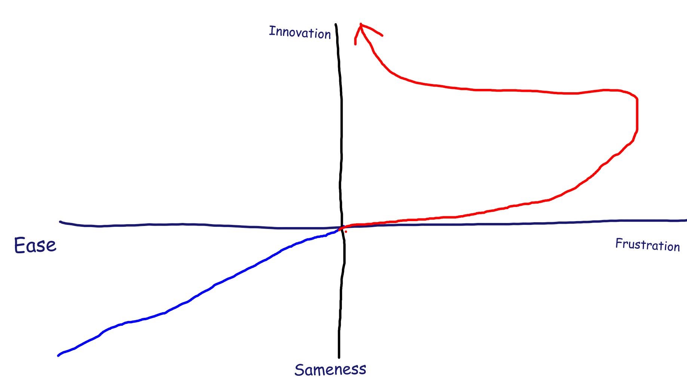

Institutions and employees within them will remain at rest unto acted upon by an internal or external force. Externally, this is the preasures of society, markets and learners demanding change. Internally, this is tempored radicals within the machine knowing the machine needs to change. But change is more complex then that, because preasures for change and the path toward change are not linear. It also means those with motivations to not remain at rest will exponentially increase in their ability to not stay at rest. One innovation after immense frustration kicks off dozens as opposed to one leading to one more.

## The Btopro Flow of Educational Innovation

In my spectrum of educational innovation, I place Ease of the staff to manage on the same axes as frustration. Something is either easy or difficult, not much to note there. Vertically we see Sameness and Innovation. Now, The easier something is, the more the same it will remain. Once we've transitioned a technology to a resting state, say ethernet cable in the walls for Fiber connectivity, then we'd like it to remain the same and be easy to maintain (I know network engineers will say it's actually frustrating as hell and the same but let's imagine here). Once that technology is at rest and stabilized, we really don't want there to be innovation in that space.

Innovation, both it's pursuit and what it takes to pursue, is a different animal. Innovation forces the individual and the organization to strive toward frustration. Frustration and perserverence lead to growth. For example, backend application development is very difficult at first. But once one masters MySQL and PHP (as examples), and then masters Ubuntu (operating system); now, the frustration subsides and the exponential inversion of the frustration, arching towards innovation can occur. And not just occur, but do so at scale.

### Virtualization
Another example. Now that you've mastered PHP/MySQL to make the underpinnings of an application. And Ubuntu for it to ride on. Learning Docker and doing something meaningful with it is relatively trivial. Using knowledge of Docker, you can virtualize and deploy the once impossibly complex and frustrating task, an infinite number of times. Your command of 1 application was greater effort then the now command of 1000s. And this, from an organizational perspective, is what leads to transformation.

## The pathway to transformation
What process are you engaged in now that will keep things the same? Is it reliance on legacy solutions? Perhaps staffing that "won't get us there" (whatever there is). Then it's possible you should accept your sameness and relegate the easy, stationary tasks to those that work there now. You must achieve stability with those best suited for stability. (note the bold) *This is also an incredibly important function of any organization. Without sameness, without ease of management, you do not have an organization to manage.*

But the process of transformation of practice, of digging in and fundamentally enhancing what was frustrating into what is now easy (and eventually the same even if previously infinitely difficult) is a different task. It's not the same. It's not better, it's not worse. There may be more conferences to submit to and it might have more "glory" as we as humans tend to glorify and appreciate different and new more then old and stable. However, these are two very different car engines : innovation, and sameness.

## Two engines
It's critical that we as bringers of the new digital revolution realize this. If we are to bring our institutions into the future, we need a different set of engines in order to do so. You don't replace the HVAC system with a next generation HVAC system while maintaining the current one. You maintain the current one, explore new ones, and then when the time is right, start to make the switch. _We need to focus our organizations on the future and dedicate thought leadership and technical expertise specifically toward that_. Where are we going is just as critical as having those maintain where we collectively are now.

<a style="background-color:black;color:white;text-decoration:none;padding:4px 6px;font-family:-apple-system, BlinkMacSystemFont, &quot;San Francisco&quot;, &quot;Helvetica Neue&quot;, Helvetica, Ubuntu, Roboto, Noto, &quot;Segoe UI&quot;, Arial, sans-serif;font-size:12px;font-weight:bold;line-height:1.2;display:inline-block;border-radius:3px;" href="https://unsplash.com/@agabriel?utm_medium=referral&amp;utm_campaign=photographer-credit&amp;utm_content=creditBadge" target="_blank" rel="noopener noreferrer" title="Download free do whatever you want high-resolution photos from Ana Gabriel"><svg xmlns="http://www.w3.org/2000/svg" style="height:12px;width:auto;position:relative;vertical-align:middle;top:-1px;fill:white;" viewBox="0 0 32 32"><title>unsplash-logo</title><path d="M20.8 18.1c0 2.7-2.2 4.8-4.8 4.8s-4.8-2.1-4.8-4.8c0-2.7 2.2-4.8 4.8-4.8 2.7.1 4.8 2.2 4.8 4.8zm11.2-7.4v14.9c0 2.3-1.9 4.3-4.3 4.3h-23.4c-2.4 0-4.3-1.9-4.3-4.3v-15c0-2.3 1.9-4.3 4.3-4.3h3.7l.8-2.3c.4-1.1 1.7-2 2.9-2h8.6c1.2 0 2.5.9 2.9 2l.8 2.4h3.7c2.4 0 4.3 1.9 4.3 4.3zm-8.6 7.5c0-4.1-3.3-7.5-7.5-7.5-4.1 0-7.5 3.4-7.5 7.5s3.3 7.5 7.5 7.5c4.2-.1 7.5-3.4 7.5-7.5z"></path></svg>Ana Gabriel</a>

But how do we lead people in organizations stuck in sameness onward toward the light? How do we get people to embrace initial frustration knowing that it ultimately leads to innovation and greater ease in their own work. Much like plato's allegory of the cave, we cannot force them to exit the cave, we have to help them question. And so, here are some questions based on how you interface with the organization or management today.

## Told
- What are you told to do?
- Do you do what you're told? Do you *only* do what you're told?
- How does it make you feel when someone tells you what to do as opposed to asks your opinion?
- What can you do to ensure your opinion is asked and not your options and innovation told to you?

## Asked
- What is it like when you are asked to explore?
- Asked your opinion? Asked for your input on a critical decision?
- How much more impactful is it to be **asked** to participate in something rather then _told_ to do something?
- What can you do to let people know what you are cable of being asked for input on?

## Capable
- What are you capable of?
- What is asked or told that is below what your capababilities are? What could you be doing?
- Where could you go and where could you take your organization if you were being used to the fullest of your capability?
- How do you express to those asking that you need to be challenged? Is it directly, or indirectly wanting challenged?

## Challenged
- Where could you go if you lived up to your current capabilities? What if you then challenged them?
- What is a challenge to you now?
- What encourages you to do more?
- To be more?
- To want more, both for yourself and your organization?

If you are willing to move along this path, to go from a stasis web of sameness into the light of innovation, I emplore you to come with us. Those we've had escape the sameness know that they can never go back, never will go back, to who they were told to be, knowing now who they are and what they can do. Both themselves, and for their organizations.

I challenge you to walk with us.

I challenge you to Transform Education; together.

#### Header Photo Credit
<a style="background-color:black;color:white;text-decoration:none;padding:4px 6px;font-family:-apple-system, BlinkMacSystemFont, &quot;San Francisco&quot;, &quot;Helvetica Neue&quot;, Helvetica, Ubuntu, Roboto, Noto, &quot;Segoe UI&quot;, Arial, sans-serif;font-size:12px;font-weight:bold;line-height:1.2;display:inline-block;border-radius:3px;" href="https://unsplash.com/@wes_c?utm_medium=referral&amp;utm_campaign=photographer-credit&amp;utm_content=creditBadge" target="_blank" rel="noopener noreferrer" title="Download free do whatever you want high-resolution photos from Wes Carpani"><svg xmlns="http://www.w3.org/2000/svg" style="height:12px;width:auto;position:relative;vertical-align:middle;top:-1px;fill:white;" viewBox="0 0 32 32"><title>unsplash-logo</title><path d="M20.8 18.1c0 2.7-2.2 4.8-4.8 4.8s-4.8-2.1-4.8-4.8c0-2.7 2.2-4.8 4.8-4.8 2.7.1 4.8 2.2 4.8 4.8zm11.2-7.4v14.9c0 2.3-1.9 4.3-4.3 4.3h-23.4c-2.4 0-4.3-1.9-4.3-4.3v-15c0-2.3 1.9-4.3 4.3-4.3h3.7l.8-2.3c.4-1.1 1.7-2 2.9-2h8.6c1.2 0 2.5.9 2.9 2l.8 2.4h3.7c2.4 0 4.3 1.9 4.3 4.3zm-8.6 7.5c0-4.1-3.3-7.5-7.5-7.5-4.1 0-7.5 3.4-7.5 7.5s3.3 7.5 7.5 7.5c4.2-.1 7.5-3.4 7.5-7.5z"></path></svg>Wes Carpani</a>