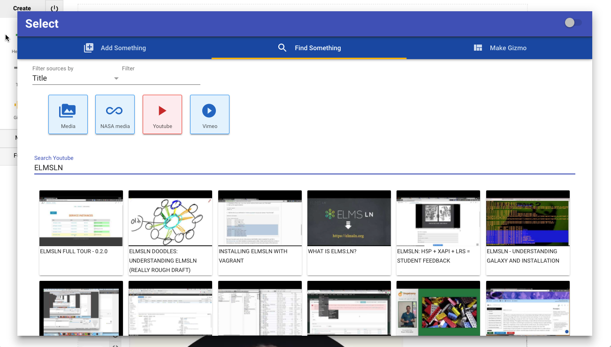

NGDLE might as well be another word for Enigma.
I mean look at it. It's a bunch of letters thrown at the wall. It's hard to pronounced or use in a sentence and people still have difficulty saying what one is let alone showing it beyond pictures of legos or other childhood toys. We all have our own ideas of what we think NGDLE is, what it could be and where it could take us. At Penn State, we're building an NGDLE called ELMS: Learning Network. For those on the development team, comprised of multiple colleges and some outside collaborators, NGDLE stands for Next Generation Distributed Learning Ecosystem.

We feel it is important to emphasize that what we're all building is both a **decentralized** and **ecosystem** driven mindset. Solutions can and will come from anywhere (decentralized + centralize), so how can we best support this ecosystem of distributed tools? ELMS:LN is an attempt at becoming a lego-grid (so to speak) of NGDLE that is kind of like a starter kit. We provide some of the bricks out of the box to give you some ideas, but the real power is in the philosophy of design of the system. No matter what bricks you plug into the grid plate, you'll always have need for the grid to keep it all together and we're trying to be one of those grids ([check us out if interested](https://www.elmsln.org)).

But what does this look like? We've got people talking about lego bicks, patterns, "grid plates"; what does any of this actually mean or look like or do?

Great question, so let's try to answer the so what with examples visual and to play with by going off a high level visual of the institution (click to expand).

## Universities, Colleges and NGDLE
To the left, we have universities. They will purchase solutions and access to tools as they always have. There's all kind of things we need in different disciplines and that won't change; but how we integrate with them will. Taking a [BYU University API](https://developer.byu.edu/docs/design-api/university-api-standard) approach, we have one system that we integrate everything with. No matter what other integrations exist, we MUST integrate with this system so we can integrate everything with it. This is a grid plate in the way that all the legos plugging into it are data and experience providers. The image has many examples all pointing to something called "HAX App Exchange".

## Instructors and Instructional Designers
If we don't unify the integration of those tools we're stuck with the people building course experiences with technology having to fight with the cognitive load of every new interface we throw at them whether built or purchased. The way we're handling this area is creating a decentralized production system that effectively gives builders a remote control. If the tools of production are easy to use, accessible, free and integrated into everything, we won't have a need for a million different platforms. We'll tell our remote control to orchestrate the universe for us. Think of it like the [Roku remote for education](http://btopro.com/blog/the-lms-is-cable-we-are-roku); stitching together a universe of separate "channels" into one unified interface.
## HAX - Headless Authoring eXperience
We call our unified user experience HAX, [which you can play with yourself in a live demo here](http://haxtheweb.org). HAX implies that we can pick up this authoring experience and embed it into anything. At the moment we have the identical authoring experience working in ELMS:LN, Drupal 6, Drupal 7, GravCMS and BackdropCMS. The goal isn't to keep it only there, it's to get it integrated with all LMSs and show people how they can integrate it into their own solutions.

If I want to edit the way a video looks, I should be able to reach out and touch the video and modify it.
If I want to embed a video from Youtube, I should be able to search, find, select, and customize all in the same place without ever going to Youtube.

With HAX, you can, but Youtube is just the beginning. What if we could wire anything up to the HAX app exchange and then create an infinite ways to accessibly present that information?

### How is this even possible for a small team?
HAX is built on a technology called Webcomponents. Webcomponents are changing the way people build things on the web. Imagine HTML but you could define your own tags. If I wanted a branded video player, I could utilize a `<video-player>` tag and it would render.

Or present a table of data and `<lrn-table>` would handle all the accessibility so long as I gave it a csv file.
