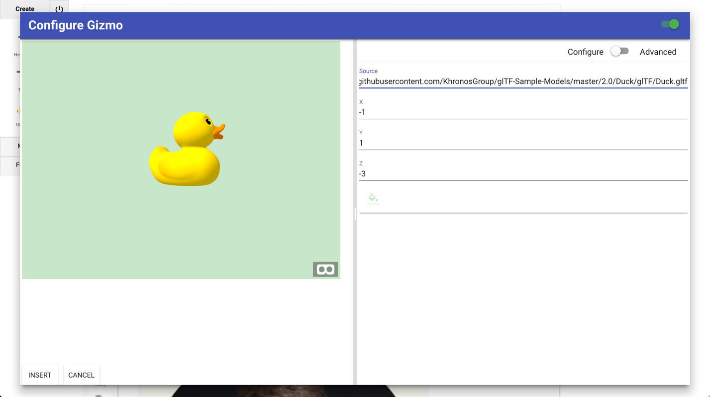

I mean look at it! It's a bunch of random letters that's hard to pronounced or use in a sentence. Years after initial usage, people still have difficulty saying what one is beyond pictures of childhood toys. My poking fun is in gest though, it's a complex idea and it at least evokes an important mental picture of "things beyond the LMS matter... a lot".
At Penn State, I've been fortunate to been building this weird thing called [ELMS: Learning Network](https://www.elmsln.org/). It's an open source NGDLE and I started development prior to the term (_fun fact_). For those on the development team, NGDLE means Next Generation **Distributed** Learning **Ecosystem**.
[ELMS:LN](https://www.elmsln.org/) and the projects that make it up (it's actually a system of systems) seek to provide those mythical lego-grid-plates in the NGDLE picture. We provide some of the bricks out of the box to give you some ideas, but the real power is in the philosophy of design of the system. No matter what bricks you plug into the grid plate, you'll need a grid to keep it together and this is an attempt to be one of those grid plates.
We've been running courses via [ELMS:LN](https://www.elmsln.org/) since 2014, so what does our vision of NGDLE look like? What does any of this actually **mean** or **look like** or **do**? Hopefully this will help. Let's start at the highest level and drill down from there to real things. (click to expand)

## Universities, Colleges and NGDLE

Universities buy and build solutions but one of the biggest issues no matter what is getting people to know that the thing even exists! There's all kind of things we need in different disciplines too, and that won't change, but how we integrate with them should. Taking a page from [BYU's University API](https://developer.byu.edu/docs/design-api/university-api-standard), we have one system that we integrate everything with! This is a grid plate for APIs, all plugged in to provide access to data and experience providers. This grid plate we call the "HAX App Exchange".

## Instructors and Instructional Designers
So we've got our integrations unified but what about where we all consume these things? LMSs, CMSs and portals all integrate with, build and present information differently. One plugs into Box / Google Drive, another doesn't. One talks LTI, the other less fluent. To TRY and simplify things we just said "talk LTI vendors" and many do, but there's way more that don't (and never will). So you go to different places for information (and your students do too) and you get a lot of cognitive load every time you have to learn something new just to put the file into one place vs another. Isn't there a better way to handle the consuming side of systems?
Imagine if we had a remote control for instructional system construction. If we could tell files where and how we want them available to users with minimal cognitive load. If it worked anywhere. In LMSs, CMSs, even desktop and mobile apps! Think of it like the [Roku remote for education](http://btopro.com/blog/the-lms-is-cable-we-are-roku); stitching together a universe of separate "channels" into one unified interface while providing a standard way of presenting them.
## HAX - Headless Authoring eXperience
HAX is short for Headless Authoring eXperience; which means that it can be integrated agnostic of any system! Think WYSIWYG editor but on steriods and built future focused (and actually WYSIWYG not Sorta-what-you-wanted-is-what-you-get). We've currently wired HAX into [ELMS:LN](https://www.elmsln.org/), [Drupal 6, Drupal 7](https://www.drupal.org/project/hax), [GravCMS](https://github.com/elmsln/grav-plugin-hax), [BackdropCMS](https://backdropcms.org/project/hax) and [a desktop app](https://github.com/LRNWebComponents/hax-desktop-app). The goal isn't to stop there, it's just to illustrate that we can build an identical authoring experience across platforms utilizing the exact same code to do so.
So if we reach out and enhance our platforms that exist currently, but tie them into this "HAX App eXchange" grid plate; what does that look like?
## Visuals
[Click here to play with HAX](http://haxtheweb.org)
If I want to edit the way a video looks, I can click and modify it.

If I want to embed a video from Youtube (or any number of sources, growing quickly), I can search, select, and customize all in one place without ever leaving the app.

If I want to modify an element, HAX presents a consistent form for doing so:

We've starting to pull media in from NASA, Kaltura, Vimeo, Youtube and internal sources. These are all just the beginning!
## How is this possible?!?
HAX is built on [Webcomponents](https://www.webcomponents.org). Webcomponents are changing the way people build things on the web. Imagine HTML but you could define your own tags. If I wanted a branded video player, I could utilize a `<video-player>` tag and the browser understand the definition and builds it (think HTML that unpacks to other HTML). Here are some more examples we've built for HAX so far:

## Future of HAX App eXchange
Why stop at media? What if we could tell the LMS we have an assignment (so we need a grade book entry) while simultaneously invoking a studio instruction space to be created for students to learn. What if we could [say the things we wanted it to do](https://www.youtube.com/watch?v=Qn8LjXjtwTg) and bring the technology to us instead of us to it!
</video-player>
