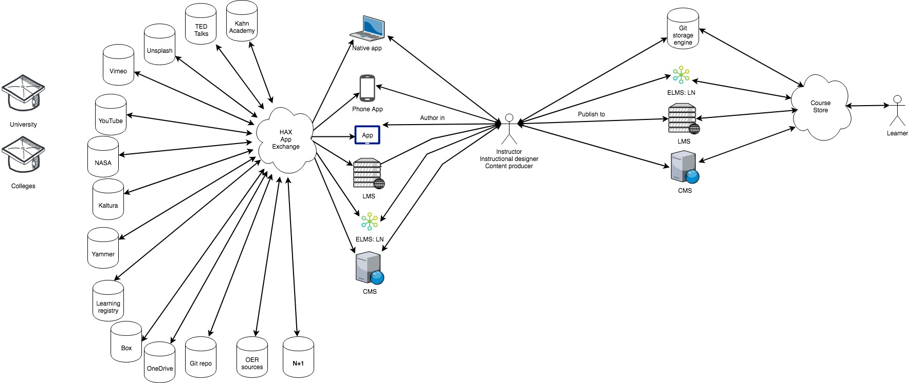

NGDLE might as well be another word for Enigma.
I mean look at it. It's a bunch of letters thrown at the wall. It's hard to pronounced or use in a sentence and people still have difficulty saying what one is let alone showing it beyond pictures of legos or other childhood toys. We all have our own ideas of what we think NGDLE is, what it could be and where it could take us. At Penn State, we're building an NGDLE called ELMS: Learning Network. For those on the development team, comprised of multiple colleges and some outside collaborators, NGDLE stands for Next Generation Distributed Learning Ecosystem.

We feel it's important to emphasize that what we're all building is both a decentralized and ecosystem driven mindset. Solutions can and will come from anywhere (decentralized + centralize), so how can we best support this ecosystem of distributed tools? ELMS:LN is an attempt at becoming a lego-grid (so to speak) of NGDLE that is kind of like a starter kit. We provide some of the bricks out of the box to give you some ideas, but the real power is in the philosophy of design of the system. No matter what bricks you plug into the grid plate, you'll always have need for the grid to keep it all together and we're trying to be one of those grids ([check us out if interested](https://www.elmsln.org)).

But what does this look like? We've got people talking about lego bicks, patterns, "grid plates"; what does any of this actually mean or look like or do?

Great question, so let's try to answer the so what with examples visual and to play with by going off a high level visual of the institution (click to expand).

## Universities, Colleges and NGDLE
To the left, we have universities. They will purchase solutions and access to tools as they always have. There's all kind of things we need in different disciplines and that won't change; but how we integrate with them will. Taking a [BYU University API](https://developer.byu.edu/docs/design-api/university-api-standard) approach, we have one system that we integrate everything with. No matter what other integrations exist, we MUST integrate with this system so we can integrate everything with it. This is a grid plate in the way that all the legos plugging into it are data and experience providers. The image has many examples all pointing to something called "HAX App Exchange".

## Instructors and Staff

1. [Docker](https://www.docker.com/) - An application containment and deployment system of packaging.
2. [Webcomponents](https://www.webcomponents.org/) - Browsers can understand developer defined tags like `<home-page-button>`
3. API Standards - [oAuth2](https://oauth.net/2/) (beyond just LTI), REST, RPC, [JSON Schema](http://json-schema.org/)

## Docker

Let's look at a shipping container for comparison to educational technologies. All of the guts of that container don't matter to those in the shipping industry, they only care about it being the right size and shape with a door that opens in a consistent way.
Now, in edtech, what we'll care about in reaching toward NGDLE isn't that different. If each container is an educational experience or course, we don't care how different they are so long as they conform to certain standardards in "shipping" so to speak. For institutions, that's things like the syllabus. For technologists that's answering "Can I sustainably run and manage this system whether on premisis, in the cloud or vendor supported?". As NGDLE will encompass a mix of bought and built solutions playing nice, them conforming to certain design patterns is important.

